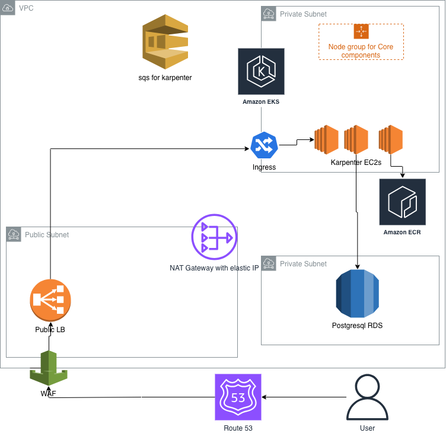

## 1) Cloud Environment Structure
- **Accounts/Projects:**
	- **prod** (production), **stg** (staging), **sandbox** (experiments), plus **shared-services** (CI/CD, artifacts, IAM identity)
	- **Organization-level controls:** AWS Organizations SCPs to restrict regions, enforce encryption, block public buckets, and require MFA.
	- **Identity:** Central IdP (Okta/AAD) -> AWS SSO. Developers assume least-privileged roles.

## 2) Network Design (VPC)
- **Per env VPC** with **/16 CIDR**, split into private subnets across **3 AZs** (no workers in public subnets).
- **Ingress:** Internet-facing ALB -> NLB (for gRPC/HTTP2 if needed) -> EKS Ingress Controller. WAF on ALB. CloudFront optional for SPA caching.
- **Egress:** NAT Gateway per AZ for private subnets; VPC endpoints for S3, ECR, STS to cut NAT costs and improve security.
- **Security:**
	- SGs: ALB SG only allows 80/443 from internet; worker nodes SG allows control-plane 443/10250 and node-to-node; DB SG only from app SG

## 3) Compute Platform (EKS)
- **Cluster:** One EKS per env. Control plane managed. Version tracked (e.g., 1.34), upgraded quarterly.
- **Node groups:**
	- **Karpenter** for dynamic capacity: two NodePools
		- `nodepool-amd64`: c5/c6a/c6i/m6i medium Spot/On-Demand mix for x86.
		- `nodepool-arm64`: c6g/c7g/m6g/m7g medium Spot/On-Demand mix for Graviton.
	- **Managed node group (small)** for system add-ons / karpenter
	- Use **taints/tolerations** so system pods pin to base, apps to Karpenter. Pod topology spread across AZs.
- **Autoscaling:** Karpenter + HPA/VPA for pods
- **Resource policy:** Requests/limits set
- **Containerization & CI/CD:**
	- Build images via CI (GitHub Actions) using multi-arch buildx
	- Push to ECR or Github Artifacts. Immutable tags + SHA pinning in manifests/Helm.
	- Deploy via ArgoCD/Flux (GitOps) or Helm in CI. Blue/green or canary via Argo Rollouts.
- **Observability:** EKS control plane logs to CloudWatch; data plane via Fluent Bit to CloudWatch/S3; metrics via AMP + Prometheus; tracing via X-Ray or OTEL collector.

## 4) Database (PostgreSQL)
- **Service:** Amazon RDS PostgreSQL (Multi-AZ) for HA
- **Security:** Encrypted at rest (KMS), SG-limited to app SG. Use IAM auth for service access, rotate creds via Secrets Manager.
- **Backups & DR:** Automated backups (7–35 days)
- **Maintenance:** Minor versions auto-applied in window; performance monitoring via Performance Insights

## 5) App Deployment Workflow (dev -> prod)
1. Dev pushes code -> CI runs tests/lint -> build multi-arch image -> scan -> push to ECR.
2. CI updates Helm values/manifests with image digest -> GitOps tool applies to EKS.
3. HPA scales pods; Karpenter provisions matching nodes (arm64 or amd64) based on nodeSelectors/affinity.
4. Ingress routes traffic via ALB with TLS/WAF; pods talk to RDS via private SG.

## High-Level Diagram

